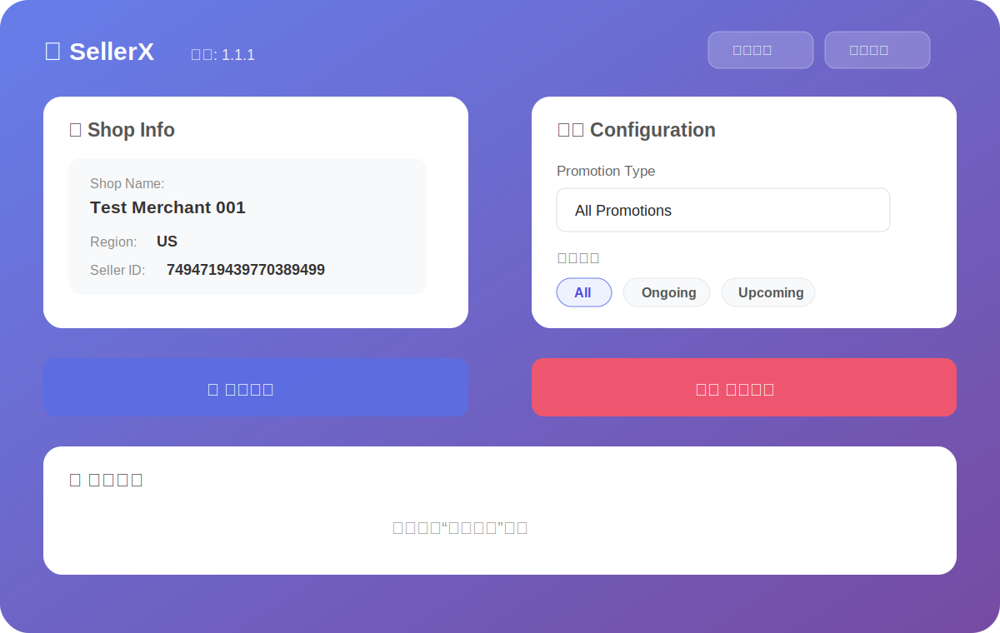
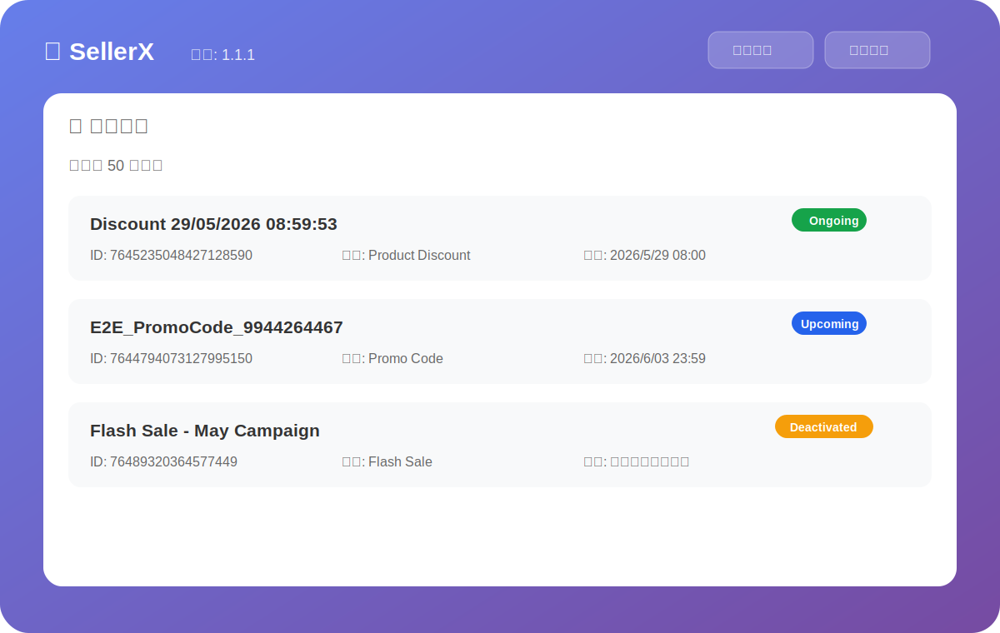
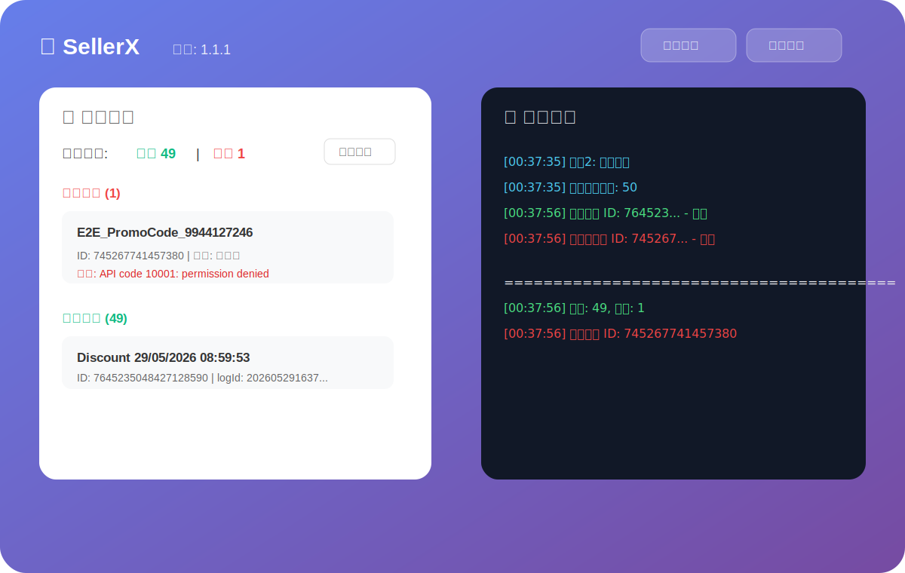

# SellerX

SellerX 是一个 Chrome Extension，用于批量查询、管理和删除 TikTok Shop Seller Center 店铺中的促销活动。

当前版本：`v1.1.6`

## 主要功能

- 自动识别当前 Seller Center 页面中的店铺信息，包括 `Seller ID`、`Shop Name`、`Shop Code` 和 `Region`。
- 支持 TikTok 与 Tokopedia Seller Center 域名，覆盖 US、MX、ID 等多地区场景。
- 支持多种促销活动类型筛选，例如 Product Discount、Flash Sale、Live Flash Deal、Creator LIVE deal、Regular coupon、Live Voucher、Creator Voucher、Promo Code、Buy X Get Y、Follow Voucher 等。
- 支持按状态查询活动：`All`、`Ongoing & Upcoming`、`Ongoing`、`Upcoming`、`Deactivated`、`Ended`。
- 支持自动捕获或手动配置泳道 Header，查询和删除可复用 `x-tt-env`、`x-use-ppe`。
- 支持批量删除 `Ongoing` 和 `Upcoming` 活动，并对不可删除状态进行保护。
- 支持列表内单条删除 `Ongoing` 和 `Upcoming` 活动。
- 提供执行日志、删除结果汇总、成功/失败明细和一键复制结果。
- 支持一键打开作者飞书聊天，便于反馈问题。
- 支持 Chrome Web Store 安装和自动更新，同时保留 GitHub Releases 安装包作为备用方式。

## v1.1.6 更新重点

- 优化批量删除性能：删除多个活动/券时改为受控并发执行，减少等待时间，同时保留成功/失败明细。
- 优化多状态查询性能：查询 `Ongoing & Upcoming` 或多个状态时按 Tab 并发请求，提升查询速度。
- 优化并发查询日志：并发请求完成后仍按 Tab 顺序展示日志，避免日志交错影响排查。
- 保持查询分页策略稳定：每个 Tab 内分页仍按顺序查询，兼顾速度和后端接口稳定性。

## v1.1.5 更新重点

- 新增 `Creator Exclusive Price` / 达人专属价筛选，使用 `promotion_type=12` 与 `display_type=23` 精确识别。
- 优化 `Live Voucher` 兼容性：同时支持 `display_type=9 / promotion_type_detail=4` 与 MX 等地区返回的 `display_type=10 / promotion_type_detail=5`。
- 补齐更多业务券类型识别，包括 `Shop New User Voucher`、`Creator Voucher`、`Follow Voucher`、`Seller Review Voucher` 等。
- 优化券类查询日志：未命中过滤条件时输出服务端返回类型分布，方便继续校准各国家/各业务线的枚举。
- 优化 Chrome Web Store 安装后的更新说明与使用手册入口，用户可通过商店安装并自动更新。

## v1.1.4 更新重点

- 扩展活动类型筛选：新增 `Live Flash Deal`、`Buy X Get Y`、`Live Voucher`、`Shop New User Voucher`、`Creator Voucher`、`Follow Voucher`、`Seller Review Voucher`。
- 修复 `Promo Code` 筛选异常：移除重复的错误入口，统一使用 `promotion_type=9` 与 `display_type=17`。
- 修复券类筛选不精确问题：服务端可能返回同一券桶下的混合结果，前端会按 `display_type` 再做一次精确过滤。
- 优化活动类型识别：优先使用 `display_type`，其次使用 `promotion_type_detail`，最后才回退到 `promotion_type`。
- 优化日志展开布局：日志展开后 Shop Info 会压缩为窄摘要区域，给执行日志和配置区域留出更多可用空间。

## v1.1.3 更新重点

- 新增 `Ongoing & Upcoming` 查询状态，并作为默认查询状态，只查询当前支持删除的 `Ongoing` 与 `Upcoming`。
- 新增泳道 Header 管理：支持自动捕获或手动保存 `x-tt-env`、`x-use-ppe`，查询、批量删除和单条删除都会复用同一组 Header。
- 优化泳道状态展示：使用 `Prod（线上）` / `PPE（自动/手动）` 标识当前请求环境，并在日志中同步输出。
- 优化主界面布局：Shop Info 与 Configuration 合并为一个配置面板，中间使用分割线；日志展开后自动切换为上下布局。
- 优化操作按钮：`查询活动` 改为更高对比度的绿色按钮，批量删除按钮文案从 `删除活动` 改为 `全部删除`。
- 优化日志面板交互：日志开关固定在左上区域，日志面板标题右侧新增 `隐藏` 按钮。
- 新增联系作者入口：顶部新增飞书聊天按钮，点击可直接打开与作者的飞书聊天窗口。
- 删除结果中的类型展示为更详细的业务类型，例如 `Flash Sale`、`Creator LIVE deal`、`Shipping Discount`、`Buy More Save More`。
- 根据后端 IDL 校准活动展示枚举：修正 `Bundle Deal`、`Promo Code`、`Early Bird`、`SNS` 等 `display_type`，并补齐更多活动类型展示名称。
- 查询日志新增原始 `promotion_type`、`display_type`、`promotion_type_detail`，方便后续继续校准特殊活动类型。

## v1.1.2 更新重点

- 修复 Creator LIVE deal 查询逻辑，使用 `promotion_type=5` 搭配 `display_type=16` 区分 Flash Sale 与 Creator LIVE deal。
- 查询结果中会根据 `display_type` 正确展示 Flash Sale / Creator LIVE deal。
- 活动列表为 `Ongoing` 和 `Upcoming` 的单个活动/券新增独立删除按钮，支持逐条删除。

## v1.1.1 更新重点

- 重构 `popup.js`，拆分为配置、状态、API、Seller 信息、Promotion 服务、DOM 渲染和日志模块。
- 将查询状态改为 5 个单选 tabs，降低误操作风险。
- 增强活动列表展示，新增状态标签、活动 ID、类型、开始时间和结束时间。
- 优化删除结果面板，支持成功/失败分组、失败原因展示、结果复制和滚动限制。
- 增强后台请求错误处理，区分网络错误、HTTP 错误和 JSON 解析错误。
- 修复 GitHub Actions 中 CRX 自动打包流程，已验证 `CHROME_EXTENSION_PRIVATE_KEY` Secret 生效。

## 界面预览

### 主界面



### 活动列表



### 删除结果与执行日志



## 安装方式

### 方法 1：从 Chrome Web Store 安装（推荐）

推荐直接通过 Chrome Web Store 安装，后续版本会由 Chrome 自动更新。

1. 打开 [SellerX - Chrome Web Store](https://chromewebstore.google.com/detail/sellerx/mlienbhlbggdmbinchmkddnbjcffoked)。
2. 点击「添加至 Chrome」完成安装。
3. 也可以在 Chrome Web Store 里搜索 `SellerX` 后安装。
4. 如果觉得好用，欢迎在商店页面底部点个五星好评。

### 方法 2：从 GitHub Releases 下载 ZIP

如果无法访问 Chrome Web Store，或需要手动安装指定版本，可以使用 `sellerx-extension.zip`。

1. 打开 [SellerX Releases](https://github.com/1378496782/SellerX/releases)。
2. 下载最新版本中的 `sellerx-extension.zip`。
3. 打开 Chrome，进入 `chrome://extensions/`。
4. 将 zip 拖动到「所有扩展程序」页面。

### 方法 3：从源码安装

适合需要查看或修改代码的场景：

```bash
git clone https://github.com/1378496782/SellerX.git
cd SellerX
```

然后在 Chrome 的 `chrome://extensions/` 中选择项目下的 `chrome-extension` 文件夹。

### 方法 4：使用作者提供的文件夹

如果你已经从作者处收到完整扩展文件夹：

1. 打开 `chrome://extensions/`。
2. 开启「开发者模式」。
3. 点击「加载已解压的扩展程序」。
4. 选择作者提供的 `chrome-extension` 文件夹。

## 使用方法

1. 登录 TikTok Shop Seller Center 或 Tokopedia Seller Center。
2. 进入店铺后台页面，确保当前页面能正常访问促销活动相关接口。
3. 点击浏览器工具栏中的 SellerX 图标。
4. 确认顶部 Shop Info 已正确识别店铺信息。
5. 选择 Promotion Type 和查询状态。
6. 点击「查询活动」。
7. 确认活动列表后，在 `Ongoing & Upcoming`、`Ongoing` 或 `Upcoming` 状态下点击「全部删除」，也可以点击单条活动右侧的「删除」。
8. 在删除结果区域查看成功/失败明细，必要时点击「复制结果」进行问题反馈。

## 删除保护规则

- `All`：可查询多个状态，但不会启用批量删除按钮。
- `Ongoing & Upcoming`：默认查询状态，只查询可删除的进行中和未开始活动。
- `Ongoing`：查询到活动后允许删除。
- `Upcoming`：查询到活动后允许删除。
- `Deactivated`：仅查询，不允许删除。
- `Ended`：仅查询，不允许删除。
- 切换活动类型或状态后，删除按钮会自动禁用，需要重新查询后才能继续操作。

## 实现踩坑

### Promotion Type 与 Display Type

促销活动类型不能只依赖 `promotion_type` 判断。`promotion_type` 更像后端查询使用的一级大类或查询桶，多个业务活动可能共用同一个 `promotion_type`。

例如 Flash Sale 与 Creator LIVE deal 都可能落在相同的大类中，需要继续结合 `display_type` 才能区分：

```text
promotion_type=5, display_type=4   -> Flash Sale
promotion_type=5, display_type=16  -> Creator LIVE deal
```

因此当前展示活动类型时采用以下优先级：

```text
display_type -> promotion_type_detail -> promotion_type
```

### 券类筛选的二次过滤

部分券类活动会共用同一个券桶，服务端即使传入 `display_type`，也可能返回同一桶下的混合结果。例如 `Regular coupon` 与 `Follow Voucher` 都可能通过 `promotion_type=2` 查询到。

为避免列表中混入其他券类，SellerX 会在接口返回后按所选 `display_type` 再做一次客户端精确过滤：

```text
Follow Voucher -> promotion_type=2, display_type=21
Regular coupon -> promotion_type=2, display_type=1
```

日志中会输出服务端返回数量和精确过滤后的数量，方便排查类似问题。

### Promo Code 的真实筛选参数

`Promo Code` 不能使用 `promotion_type=17` 查询，否则接口可能退化为近似全量结果。当前统一使用：

```text
promotion_type=9, display_type=17
```

## 自动更新说明

推荐通过 [Chrome Web Store](https://chromewebstore.google.com/detail/sellerx/mlienbhlbggdmbinchmkddnbjcffoked) 安装 SellerX。通过商店安装后，后续版本会由 Chrome 自动更新，不需要手动下载新包。

- Chrome Web Store 自动更新不是实时触发，通常会有一定延迟。
- 从 GitHub Releases 手动拖拽 `sellerx-extension.zip` 安装的版本，不走商店自动更新；需要更新时请重新下载最新 ZIP 并覆盖安装。
- 通过「加载已解压的扩展程序」安装的开发模式版本，也需要手动替换文件夹或重新加载新版本。

## 项目结构

```text
smartQ/
├── .github/workflows/
│   └── release.yml              # GitHub Actions 自动发布流程
├── chrome-extension/
│   ├── icons/                   # 扩展图标
│   ├── src/
│   │   ├── api-client.js        # Chrome API 和 runtime message 封装
│   │   ├── config.js            # 活动类型、状态、域名等配置
│   │   ├── dom.js               # DOM 渲染和 UI 状态管理
│   │   ├── logger.js            # 日志输出与 HTML 转义
│   │   ├── promotion-service.js # 活动查询和删除逻辑
│   │   ├── seller-service.js    # Seller 信息识别与 Cookie fallback
│   │   └── state.js             # 应用状态管理
│   ├── background.js            # 后台请求代理和错误处理
│   ├── manifest.json            # Chrome Extension 配置
│   ├── popup.html               # 插件主界面
│   ├── popup.js                 # 页面入口和流程编排
│   ├── styles.css               # 样式文件
│   └── update.xml               # Chrome 外部更新配置
├── utils/                       # 发布和图标处理辅助脚本
└── README.md
```

## 发布流程

当前发布通过 GitHub Actions 自动完成：

1. 更新 `chrome-extension/manifest.json` 中的版本号。
2. 更新 `popup.html` 中的版本展示。
3. 更新 `chrome-extension/update.xml` 中的版本和 CRX 下载地址。
4. 提交代码并推送到 `main`。
5. 创建并推送版本 tag，例如 `v1.1.1`。
6. GitHub Actions 自动构建并上传以下资产：
   - `sellerx-extension.zip`
   - `sellerx-extension.crx`
   - `update.xml`

CRX 自动构建依赖 GitHub Secret：

```text
CHROME_EXTENSION_PRIVATE_KEY
```

## 注意事项

- 本工具会直接删除促销活动，请在操作前确认当前店铺、活动类型和查询状态。
- 建议优先使用 `Ongoing & Upcoming` 查询并核对列表，再执行删除。
- 如果当前页面处于 PPE / 泳道环境，请确认环境卡片显示为 `PPE`；若未自动捕获，请手动填写 `x-tt-env` 和 `x-use-ppe`。
- 如果删除失败，请复制删除结果并提供给作者排查。
- 本项目主要用于内部效率工具场景，开发时间有限，可能仍存在边界问题。

## 联系作者

如遇到问题或发现 bug，欢迎联系：

- 邮箱：<zhangfuwei.666@bytedance.com>
- 微信：`xjtu915`

## 许可证

MIT License
